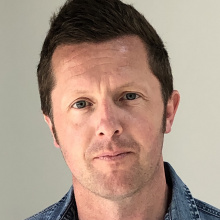
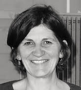

## Overview

All times are BST (UTC+1).

|Day 0: Monday 15th July|
|---|
|1300 Check-in opens for those with pre-booked accommodation at Robinson College|
|1800 Walking Tour of Cambridge (sign up on the [Registration page](../registration))|

|Day 1: Tuesday 16th July|
|---|
|0900 Welcome, Registration, Coffee|
|0930 Keynote 1|
|1030 Break|
|1045 Talks 1|
|1145 Break|
|1200 Talks 2|
|1300 Lunch|
|1400 Talks 3|
|1500 Break|
|1530 Panel Discussion|
|1630 Poster Session & Drinks Reception|
|1830 Conference Dinner|

|Day 2: Wednesday 17th July|
|---|
|0900 Welcome, Registration, Coffee|
|0930 Keynote 2|
|1030 Break|
|1045 Talks 4|
|1145 Break|
|1200 Talks 5|
|1300 Lunch|
|1400 Talks 6|
|1500 Break|
|1530 Talks 7|
|1630 Conference Close|
|1815 Chauffered Punt Tour, Scudamore's Mill Lane (sign up on the [Registration page](../registration))|

## Day 0 schedule: Monday 15th July

### 1300 - Check-in opens at Robinson College

For those who have pre-booked accommodation (see the [Registration page](../registration) for availability).
Please go to the Porters' Lodge on Grange Road, CB3 9AN. Telephone: +44 (0)1223 33910.

### 1800 - Walking tour of Cambridge

A 90-minute guided walking tour of Cambridge city centre.
Sign up on the [Registration page](../registration).
Meeting place: corner of Quayside and Bridge Street (near Prezzo & Scudamore's Punt Station).

## Day 1 schedule: Tuesday 16th July

### 0900 - Welcome, Registration, Coffee

In the foyer of the Crausaz Wordsworth Building, Robinson College, Adams Rd, Cambridge CB3 9AD.
_Please note that on-site parking is limited: get in touch if you have questions about this._

### 0930 - Keynote 1, Plenary room

Dr Brian Clancy, Mary Immaculate College, Ireland

_Bio_: Brian Clancy is a lecturer in applied linguistics at Mary Immaculate College, Ireland. His
research work focusses on the blend of a corpus linguistic methodology with the
discourse analytic approaches of pragmatics and sociolinguistics. His primary
methodological interests relate to the use of corpora in the study of language varieties
and the construction and analysis of small corpora. His published work explores
language use in intimate settings, such as between family and close friends, and the
language variety Irish English. He is author of _Investigating Intimate Discourse:
Exploring the spoken interaction of families, couples and close friends_ (Routledge, 2016)
and co-author, with Anne O’Keeffe and Svenja Adolphs, of _Introducing Pragmatics in Use_
(Routledge, 2011 and 2020).

_Title_: **A Many-Splendored Thing: (Corpus) Perspectives on Intimate Discourse**

_Abstract_: This paper takes a pluralistic, corpus approach to explorations of intimate discourse. Intimate
discourse, that is to say the conversation between couples, family and close friends, is an
integral part of our lives and everyday spoken world. Much of the initial literature on intimacy
explored what might be referred to as ‘established intimacy’, with a focus on parents with
children or friends that lived in shared accommodation over a long period of time (see Clancy,
2016). One of the reasons for the privileging of these sites was the issue of the accessibility of
the context, which meant that much of the data collection was, by necessity, opportunistic.
However, alongside today’s growing proliferation of data in the public domain, and more
openness to seeing the potential in different types of linguistic data, there are more routes to
intimate discourse than ever before. This has allowed researchers to continue their focus on
established intimacy, while also investigating what we can term ‘nascent intimacy’, such as
initial encounters (see, for example, Haugh and Sinkeviciute, 2021), and indeed, initial romantic
encounters. Using a comparative corpus approach that primarily utilises first-generation
concordancing tools such as keyword lists and concordance lines, and a range of small corpora
collected to represent spoken Irish English, this paper seeks to marry findings from both
established and nascent intimacy in order to determine how they might inform and
complement one another. In doing so, it argues for the value of applied corpus approaches, a
‘first principles’ orientation to seeing into datasets, and how intimate discourse, the delicate
calibration of language that is core to our interpersonal relationships, should be highlighted and
valorised.

**References**:

Clancy, B. 2016. Investigating Intimate Discourse: Exploring the Spoken Interaction of Families,
Couples and Friends. London: Routledge.

Haugh, M and Sinkeviciute, V. 2021. ‘The pragmatics of initial interactions: Cross-cultural and
intercultural perspectives.’ Journal of Pragmatics, 185, 35-39.

_Chair_: Prof Michael McCarthy

### 1030 - Break, Foyer

### 1045 - Talks 1

|Plenary room|_Chair: Odette Vassallo_|
|---|---|
|1045|**Encarnacion Hidalgo-Tenorio, Miguel Angel Benitez-Castro, Aritz Gorostiza, Juan Luis Castro-Peña** : Nutcracker, a semi-supervised algorithm for the detection of online extremism and disinformation|
|1105|**Theodora Alexopoulou** : The influence of L1 typology on the acquisition of the L2 English article: a large scale corpus study|
|1125|**Elaine Riordan, Fiona Farr, Andrew Caines, Paula Buttery** : The Teacher-Student Chatroom Corpus: Exploring Student Teachers' Linguistic Choices and Perceptions|

|Syndicate 1|_Chair: Brian Clancy_|
|---|---|
|1045|**Michael T. L. Pace-Sigge** : Deborah, Linguist yet Professor Michael. How British corpora reflect gender-relation through forms of address|
|1105|**Ninuk Krismanti, Liam Murray, Brona Murphy** : A corpus-based study on an Indonesian University EFL Teacher Translanguaging Strategies|
|1125|**Paula Wood Borque** : Development of materials for the English as Foreign Language classroom: Compilation and analysis of a multimodal corpus|

|Syndicate 2|_Chair: Chris Fitzgerald_|
|---|---|
|1045|**Valentin Werner, Robert Fuchs, Anna Rosen, Lea Bracke, Bethany Stoddard** : Introducing the Corpus of Young German Learner English|
|1105|**Rachele De Felice, Kate Warwick** : A new dataset for email research and professional communication: Fauci2020|
|1125|**Mateus De Souza, Michael McCarthy** : Exploring response tokens across proficiency levels: a spoken learner corpus study|

|Syndicate 3|_Chair: Pascual Pérez-Paredes_|
|---|---|
|1045|**Christoph Rühlemann** : Does gesture expressivity contribute to emotional resonance in storytelling interaction?|
|1105| **Liina Repo** : Investigating Document Internal Variation: Modeling Historical Registers and Assessing the Impact of Text Segments on Register Classification|
|1125|**Lilia Shevyrdyaeva** : Academic tribes and discursive identity: metadiscourse patterns in research articles in closely related life sciences|

### 1145 - Break, Foyer

### 1200 - Talks 2

|Plenary room|_Chair: Elaine Riordan_|
|---|---|
|1200|**Carolina Amador-Moreno, Ana María Terrazas-Calero** : Framing lithium to attract stakeholders: using CL to investigate language and Ecology|
|1220|**Robbie Love, Nele Põldvere** : Variation across spoken genres: comparing the Spoken British National Corpus 2014 and the London-Lund Corpus 2|
|1240|**Pascual Pérez-Paredes** : The power of stories: multilingual corpora and critical discourse analysis CANCELLED)|

|Syndicate 1|_Chair: Gabrielle Gaudeau_|
|---|---|
|1200|**Catherine Wong** : Sherlock Holmes in the Computer: Quantitative Stylistic Methods|
|1220|**Virginia Mattioli** : Crossing Translation Universals research and Language Variety studies: explicitation of the optional conjunction “that” in British and American translated novels|
|1240|**Adina Ioana Vladu, Claudio Rodríguez Fer** : Unraveling the Linguistic Tapestry: A Computational Exploration of José Ángel Valente's Poetry|

|Syndicate 2|_Chair: Yuan Gao_|
|---|---|
|1200|**Sijie Mou** : Rhotacisation in the Beijing Dialect: A study of Erhua|
|1220|**Shangran Jin, Gwen Bouvier, Zhao Li** : Self-help and cybersuperstition on China’s social media Xiao Hongshu: Moralizing and objectifying luck|
|1240||

|Syndicate 3|_Chair: Andrew Caines_ (pre-recorded talks)|
|---|---|
|1200|**Saqib Aziz** : Use of Lexical bundles in academic writing in English by expert writers, L1 English students, and L2 English students of Applied Linguistics|
|1220|**Ilia Afanasev, Olga Lyashevskaya** : Combining string similarity measures and frequency-based metrics: a new approach to measuring language distance between Slavic lects|
|1240|**Katherine Oliva Ortolani** : The Dimensions of Fashion, a Multi-dimensional Study|

### 1300 - Lunch, Foyer

### 1400 - Talks 3

|Plenary room|_Chair: Mateus De Souza_|
|---|---|
|1400|**Dawn Knight, Paul Rayson, Mo El-Haj, Nouran Khallaf, Ignatius Ezeani, Steve Morris** : FreeTxt: a corpus-based approach to bilingual free-text survey and questionnaire data analysis|
|1420|**Christopher Fitzgerald, Justin McNamara, Anne O'Keeffe, Dawn Knight, Geraldine Mark, Sandrine Peraldi, Tania Fahey Palma, Fiona Farr, Ben Cowan, Svenja Adolphs** : Interactional Variation Online: Building and Analysing a Corpus of Virtual Workplace Meetings|
|1440|**Justin McNamara, Anne O'Keeffe, Christopher Fitzgerald, Dawn Knight, Sandrine Peraldi, Geraldine Mark, Tania Fahey Palma, Fiona Farr, Benjamin Cowan, Svenja Adolphs** : Is that an old hand?’ Corpus Insights into Managing Virtual Meetings|

|Syndicate 1|_Chair: Yuan Gao_|
|---|---|
|1400|**Jing Chen, Yun Liu** : Metadiscourse in Research Article Abstracts in Musicology: An English-Chinese Comparative Study|
|1420|**Ziwei Guo, Yu Chen** : A neural network model for constructional priming (resonance) in Mandarin and American English interaction|
|1440|**Hu Haiping** : A Corpus-Based Study on Translator’s Style——Based on Translated Versions of Tao Te Ching by Arthur Waley and John Minford|

|Syndicate 2|_Chair: Gabrielle Gaudeau_|
|---|---|
|1400|**Michelle Zeping Huang, Kacey Jianwen LIU** : Discourse of Menopause on Social Media across Cultures: A Corpus-Assisted Comparison between X and Weibo|
|1420|**Wenxuan Ren** : An UFA-approach to diachronic investigation into the identity construction of vegetarian in China Daily|
|1440|**Katrien Deroey, Jane Helen Johnson** : Importance marking in EMI and L1 lectures|

|Syndicate 3|_Chair: Diana Galvan-Sosa_|
|---|---|
|1400|**Cathryn Bennett** : Employing learner needs in corpus literacy teacher education (CLTE) programmes|
|1420|**Sepideh Daghbandan** : Conversational Language Forms used by Learners of Persian: Insights from a Learner Corpus-based Study|
|1440|**HE Liang** : Researching Poverty-themed Children’s Picture Books in the Contemporary United States: An Approach of Multimodal Discourse Analysis|

### 1500 - Break, Foyer

### 1530 - Panel Discussion, Plenary room

_Topic_: Trust the Text? Generative AI and Corpus Linguistics

_Discussants_: Michael McCarthy, Paula Buttery, Dawn Knight, Michael Handford

_Chair_: Andrew Caines

### 1630 - Poster Session & Drinks Reception

|Plenary room|_Chairs: Diana Galvan-Sosa, Yuan Gao, Gabrielle Gaudeau_|
|---|---|
|*|**Yueming Du, Shue Sum Leung** : Do features of lexical richness distinguish and predict Chinese-as-a-Second-Language writing quality?|
|*|**Luís Martínez-Kleiser Magaña** : Online dissemination of scientific content for educational purposes: recontextualising texts for teenage audiences|
|*|**Nazym Shaikhina** : Shaping Perspectives: Unraveling Gender Narratives in Kazakhstani Education through the Lens of "Ozin-ozi tanu" Textbooks|
|*|**Lingmin Huang, Yuanke Li** : Revisiting the relationships of n-gram measures to L2 writing proficiency: Comparisons between genres and connections to vocabulary levels|
|*|**Yixing Liu** : China's Media Representations of Vegetarianism: A Corpus-Assisted Discourse Analysis|
|*|**Ridha Rashed Alanazi** : Exploring The Use of Formulaic Language in English Learning: A Corpus-Based Study of Arabic Students at a Saudi University|
|*|**Charles Lam** : Sub-disciplinary Variations in Biology Texts and Implications on Instructions|
|*|**Jing Huang, Tanjun Liu** : Digital mediation of romantic relationships in China: Scholarly educational videos’ comments on Bilibili|
|*|**Qianhui Sun** : Hands-off data-driven learning for Chinese students of English at the basic-independent levels|
|*|**Agustina Lestary** : A Corpus-Based Analysis of Teachers’ Questions in an EFL (English as Foreign Language) Classroom in Higher Education Context in Indonesia|
|*|**Tanjun Liu** : Investigating formulaic sequences in university students’ disciplinary writing|

### 1830 - Conference Dinner

The Main Hall, Robinson College. _Please note that the dinner is not included in your registration fee. If you still wish to attend, please purchase a dinner ticket asap via the_ [Registration page](../registration).

## Day 2 schedule: Wednesday 17th July

### 0900 - Welcome, Registration, Coffee

In the foyer of the Crausaz Wordsworth Building, Robinson College, Adams Rd, Cambridge CB3 9AD.
_Please note that on-site parking is limited: get in touch if you have questions about this._

### 0930 - Keynote 2, Plenary room

Dr Geraldine Mark, Cardiff University, U.K.

_Bio_: Geraldine Mark is a corpus linguist whose interests include language development, data-driven learning, and discourse analysis. Most recently she has been working on a multi-modal corpus project, IVO (www.ivohub.com), examining multi-modal interaction in the virtual workplace. She is a Visiting Lecturer at the University of Malta, and advises on the FoRCE project, building and analysing a corpus of Maltese English. She is co-author of _English Grammar Today_ (2011, Cambridge University Press, with Ronald Carter, Michael McCarthy and Anne O’Keeffe) and co-principal researcher (with Anne O’Keeffe) of the _English Grammar Profile_, an online resource profiling L2 grammar development.

_Title_: **Shall I compare thee to the BNC?**

_Abstract_: Comparison is a cornerstone of corpus linguistics. Comparisons can be superficially simple,
but a scratch below the surface typically reveals complexity, when variation between corpora
and within corpora is not always obvious, and where “there is little understanding of what
constitutes a small or large difference between corpora” (Gablasova et al. 2017). This talk is
a personal reflection on some of the pitfalls and affordances encountered when comparing
one corpus with another, particularly in relation to learner language. I draw on three case
studies, firstly using the Cambridge Learner Corpus* to look at development in writing across
the Common European Framework of Reference (CEFR) proficiency levels, secondly
contrasting adverb use in spoken language from the LINDSEI and LOCNEC corpora†, and
finally exploring the design and development of a corpus of spoken and written Maltese
English. I touch on measures of language development in terms of quality and time (Durrant
et al. 2021), the use norms and attitudes to variation within learner corpus research, and
consider implications for corpus design and representativeness.

**References**:

Durrant, P., Brenchley, M., & McCallum, L. (2021). _Understanding development and proficiency in writing:
Quantitative corpus linguistic approaches_. Cambridge University Press.

Gablasova, D., Brezina, V., & McEnery, T. (2017). Collocations in corpus-based language learning research:
Identifying, comparing, and interpreting the evidence. _Language learning_, 67(S1), 155-179

\* The Cambridge Learner Corpus (CLC) is a corpus of written exam data from Cambridge English exams. The
data used for this study stands at 55.5 million words and comprises 266,600 exam documents of open-ended
writing, spanning 143 different first languages backgrounds, six proficiency levels, from a 17-year period
(1993–2012).

† [LINDSEI](https://uclouvain.be/en/research-institutes/ilc/cecl/lindsei.html) (Louvain International Database of Spoken English Interlanguage); [LOCNEC](https://corpora.uclouvain.be/catalog/corpus/locnec) (Louvain Corpus of Native English Conversation)

_Chair_: Prof Paula Buttery

### 1030 - Break, Foyer

### 1045 - Talks 4

|Plenary room|_Chair: Andrew Caines_|
|---|---|
|1045|**Elizabeth Hanks, Tony McEnery, Jesse Egbert, Tove Larsson, Douglas Biber, Randi Reppen, Paul Baker, Raffaella Bottini, Vaclav Brezina, Gavin Brookes, Isobelle Clarke** : The Lancaster-Northern Arizona Corpus of Spoken American English (LANA-CASE): Design, compilation, and ongoing progress|
|1105|**David Oakey, Franco Zappettini, Ziwei Guo** : Corpus creation with and without keywords – does achieving corpus “aboutness” introduce bias?|
|1125|**Laurence Anthony** : Enhancing Corpus Analysis through the Integration of Large Language Models (LLMs)|

|Syndicate 1|_Chair: Yuan Gao_|
|---|---|
|1045|**Christopher Fitzgerald, Ivor Timmis** : ‘Have your coffin ready near you for you will suffer death’ Comparing and contrasting Irish and English 19th century threatening letters|
|1105|**Guyanne Wilson** : Agreement in African and Caribbean Englishes: Collective nouns and existential constructions|
|1125|**Valentin Werner, Hendrik Michael, Lea Bracke** : Authenticity and intimacy: A corpus study on live blogs about the US presidential debates|

|Syndicate 2|_Chair: Diana Galvan-Sosa_|
|---|---|
|1045|**Michael Savage** : Corpus-driven investigation of the linguistic features of refusals in third level English language textbooks in Japan|
|1105|**Shue Sum Leung, Dora Alexopoulou** : Progression and Task-based Variability of Linguistic Complexity across Grade Levels: A Case Study of the Secondary School Reading Texts in Hong Kong|
|1125|**Maicol Formentelli, Liviana Galiano, Maria Pavesi, Raffaele Zago** : Complexity matters in film and TV dialogue: An applied linguistics perspective|

|Syndicate 3|_Chair: Gabrielle Gaudeau_|
|---|---|
|1045|**Duygu Candarli** : Multisemiotic moves in a multimodal corpus of student writing in higher education|
|1105|**Reka R. Jablonkai, Gail Forey** : Corpus-based analysis of high-stake exam papers for materials design for disciplinary literacy development|
|1125||

### 1145 - Break, Foyer

### 1200 - Talks 5

|Plenary room|_Chair: Elaine Vaughan_|
|---|---|
|1200|**Michael Handford** : Automating analysis of creativity: how can AI complement corpus analysis?|
|1220|**Mícheál J. Ó Meachair, Andrea Palandri, Gearóid Ó Cleircín** : A Synthetic Brown Corpus: Compilation, analysis, and pitfalls|
|1240|**Almut Köster** : Pragmatic markers and professional practice in care home interactions|

|Syndicate 1|_Chair: Dawn Knight_|
|---|---|
|1200|**Marcel Kückelhaus** : Deciphering German AI Narratives Using Corpus Linguistics|
|1220|**Muhammad Afzaal, Xiao Shanshan** : ChatGPT OpenAI and Human Interaction: A Contrastive Parallel Corpus-based Investigation of Syntactic Complexity features in human and Machine Translations|
|1240|**Andreas Weilinghoff** : Evaluating Whisper for Sociolinguistic Data Transcription|

|Syndicate 2|_Chair: Geraldine Mark_|
|---|---|
|1200|**Ana Eugenia Sancho Ortiz** : Methodological challenges in working with digitally mediated data: The compilation of the SciDis database|
|1220|**Johnatan E. Bonilla, Laura M. Merino Hernández, Miriam Bouzouita** : The pluralization of the existential verb haber ‘there is/are’ in written and recorded parliamentary speeches in Canarian Spanish|
|1240|**Yating Tao** : Decoding valency patterns and semantic senses: A comparative corpus analysis of TAKE in New Englishes and Learner Englishes|

|Syndicate 3|_Chair: Andrew Caines_ (pre-recorded talks)|
|---|---|
|1200|**Paul Thomas Johnson** : A New Kind of Graded Reader: The Digital Roleplaying Game|
|1220|**Xiao Liu** : Does the alignment quality of bilingual corpus have a greater impact on SMT or NMT? Taking the Spanish-Chinese legal bilingual corpus as an example, and analyzing the corpus particularities of the Spanish-Chinese language pair|
|1240|**Jean Marguerite Jimenez, Ida Ruffolo** : FAIR AND FAST FASHION? A content and linguistic analysis of gender equality in CSR reports|

### 1300 - Lunch, Foyer

### 1400 - Talks 6

|Plenary room|_Chair: Christopher Fitzgerald_|
|---|---|
|1400|**Diane Nicholls, Andrew Caines, Paula Buttery** : The Write & Improve Corpus 2024|
|1420|**Saara Hellström** : Comparing French and Swedish web registers using multilingual word vectors|
|1440|**Ivor Timmis** : ‘Dear Sir, write to mee on Mr Mudge’s backside’. Resourcefulness in letters by the poor and desperate, c.1760-1830|

|Syndicate 1|_Chair: Gabrielle Gaudeau_|
|---|---|
|1400|**Yahui Wang** : UK Media representation of COVID-during the first national lockdown: a corpus-assisted critical discourse analysis|
|1420|**Justin McNamara, Michaela Rusch** : Only a Matter of Words-A Corpus-Based Study of the Websites of Popular European Businesses Analysing Diversity and Inclusion Notes|
|1440|**Richard Badger** : Following the science: a study of the  Downing street Covid-19 press conferences|

|Syndicate 2|_Chair: Diana Galvan-Sosa_|
|---|---|
|1400|**Graham Burton, Maria Cristina Gatti** : The word list repository: creating an open resource for researchers and teachers|
|1420|**Joan O'Sullivan, Tamami Shimada** : Introducing the Corpus of New Speakers of Irish English|
|1440|**Anastasia Shavrina, Anastasia Vyrenkova, Sergei Obiedkov, Anastasia Chivikova** : Crowdsourcing for Error Correction in L2 Writing|

|Syndicate 3|_Chair: Yuan Gao_|
|---|---|
|1400|**Artur Tsymbalyuk, Lilia Shevyrdyaeva** : We used vs. We demonstrate: a diachronic comparison of self-mention in high-stakes research articles in life sciences|
|1420|**Reem F. Alfuraih** : Competence and Creativity Indicators: A Taxonomy of Translation Positive Practices in The Undergraduate Learner Translator Corpus|
|1440|**Michael T. L. Pace-Sigge** : Presence and Absence of Laughter and Gestures. Examples from the BNC-Spoken 2014 and Dickens' Novels|

### 1500 - Break, Foyer

### 1530 - Talks 7

|Plenary room|_Chair: Pascual Pérez-Paredes_|
|---|---|
|1530|**Elaine Vaughan, Brian Clancy** : Eat, pay, love: A corpus perspective on the language of first dates|
|1550|**Nina Haket, Ryan Daniels** : Why Making Words Better Is Not That Simple: Conceptual Engineering and Distributional Semantics|
|1610|**Isolde van Dorst, Mathew Gillings, Jonathan Culpeper** : Impoliteness variation in Britain: a corpus-based study|

|Syndicate 1|_Chair: Mateus De Souza_|
|---|---|
|1530|**Meiqi Li, Ting Jiang** : A Corpus-assisted Discourse Study of Disputants’ Intentionality in Chinese Family Mediation|
|1550|**Liying Zhou** : Comparing functional discourse units in Chinese and English conversational discourse: a cross-linguistic and corpus-based analysis|
|1610|**Cristina Lastres-López** : Conditionals in English and Spanish: Exploring differences in speech and writing|

|Syndicate 2|_Chair: Odette Vassallo_|
|---|---|
|1530|**Noelia Ramon, Belén Labrador** : Medals and awards:  Providing quality assurance in online promotional discourse|
|1550|**Cathryn Bennett, Ciara Wigham** : “Can I ask you just to clarify for a minute?”: Teaching pragmatics in IVE pre-service teacher training|
|1610||

|Syndicate 3|_Chair: Andrew Caines_ (pre-recorded talks)|
|---|---|
|1530|**Ljubica Leone** : The representations of freedom in The Sun newspaper between 2019 and 2021: a corpus-based study|
|1550|**Eniko Csomay** : Teaching styles and the 'mixed' category|
|1610|**Jingwen Ou** : Introducing data-driven learning into Chinese higher education EAP writing instructional settings|

### 1630 - Conference Close

### 1815 - Chauffered Punt Tour

45-minute chauffered punt tour on the River Cam from Scudamore's Punting Station on Mill Lane, CB2 1RS.
Sign up on the [Registration page](../registration).

## List of registered papers

* 1, **Dawn Knight, Paul Rayson, Mo El-Haj, Nouran Khallaf, Ignatius Ezeani, Steve Morris** : FreeTxt: a corpus-based approach to bilingual free-text survey and questionnaire data analysis
* 2, **HE Liang** : Researching Poverty-themed Children’s Picture Books in the Contemporary United States: An Approach of Multimodal Discourse Analysis
* 3, **Jingwen Ou** : Introducing data-driven learning into Chinese higher education EAP writing instructional settings
* 5, **Michael T. L. Pace-Sigge** : Presence and Absence of Laughter and Gestures. Examples from the BNC-Spoken 2014 and Dickens' Novels
* 6, **Jing Chen, Yun Liu** : Metadiscourse in Research Article Abstracts in Musicology: An English-Chinese Comparative Study
* 7, **Christopher Fitzgerald, Ivor Timmis** : ‘Have your coffin ready near you for you will suffer death’ Comparing and contrasting Irish and English 19th century threatening letters
* 9, **Christopher Fitzgerald, Justin McNamara, Anne O'Keeffe, Dawn Knight, Geraldine Mark, Sandrine Peraldi, Tania Fahey Palma, Fiona Farr, Ben Cowan, Svenja Adolphs** : Interactional Variation Online: Building and Analysing a Corpus of Virtual Workplace Meetings
* 10, **Justin McNamara, Anne O'Keeffe, Christopher Fitzgerald, Dawn Knight, Sandrine Peraldi, Geraldine Mark, Tania Fahey Palma, Fiona Farr, Benjamin Cowan, Svenja Adolphs** : Is that an old hand?’ Corpus Insights into Managing Virtual Meetings
* 13, **Ziwei Guo, Yu Chen** : A neural network model for constructional priming (resonance) in Mandarin and American English interaction
* 14, **Meiqi Li, Ting Jiang** : A Corpus-assisted Discourse Study of Disputants’ Intentionality in Chinese Family Mediation
* 15, **Saqib Aziz** : Use of Lexical bundles in academic writing in English by expert writers, L1 English students, and L2 English students of Applied Linguistics
* 16, **Michael T. L. Pace-Sigge** : Deborah, Linguist yet Professor Michael. How British corpora reflect gender-relation through forms of address
* 17, **Andreas Weilinghoff** : Evaluating Whisper for Sociolinguistic Data Transcription
* 18, **Encarnacion Hidalgo-Tenorio, Miguel Angel Benitez-Castro, Aritz Gorostiza, Juan Luis Castro-Peña** : Nutcracker, a semi-supervised algorithm for the detection of online extremism and disinformation
* 19, **Ivor Timmis** : ‘Dear Sir, write to mee on Mr Mudge’s backside’. Resourcefulness in letters by the poor and desperate, c.1760-1830.
* 20, **Christoph Rühlemann** : Does gesture expressivity contribute to emotional resonance in storytelling interaction?
* 21, **Yating Tao** : Decoding valency patterns and semantic senses: A comparative corpus analysis of TAKE in New Englishes and Learner Englishes
* 22, **Catherine Wong** : Sherlock Holmes in the Computer: Quantitative Stylistic Methods
* 23, **Nina Haket, Ryan Daniels** : Why Making Words Better Is Not That Simple: Conceptual Engineering and Distributional Semantics
* 25, **Hu Haiping** : A Corpus-Based Study on Translator’s Style——Based on Translated Versions of Tao Te Ching by Arthur Waley and John Minford
* 27, **Marcel Kückelhaus** : Deciphering German AI Narratives Using Corpus Linguistics
* 29, **Muhammad Afzaal, Xiao Shanshan** : ChatGPT OpenAI and Human Interaction: A Contrastive Parallel Corpus-based Investigation of Syntactic Complexity features in human and Machine Translations
* 30, **Ninuk Krismanti, Liam Murray, Brona Murphy** : A corpus-based study on an Indonesian University EFL Teacher Translanguaging Strategies
* 31, **Sijie Mou** : Rhotacisation in the Beijing Dialect: A study of Erhua
* 34, **Luís Martínez-Kleiser Magaña** : Online dissemination of scientific content for educational purposes: recontextualising texts for teenage audiences.
* 35, **Elizabeth Hanks, Tony McEnery, Jesse Egbert, Tove Larsson, Douglas Biber, Randi Reppen, Paul Baker, Raffaella Bottini, Vaclav Brezina, Gavin Brookes, Isobelle Clarke** : The Lancaster-Northern Arizona Corpus of Spoken American English (LANA-CASE): Design, compilation, and ongoing progress
* 37, **Nazym Shaikhina** : Shaping Perspectives: Unraveling Gender Narratives in Kazakhstani Education through the Lens of "Ozin-ozi tanu" Textbooks
* 38, **Lingmin Huang, Yuanke Li** : Revisiting the relationships of n-gram measures to L2 writing proficiency: Comparisons between genres and connections to vocabulary levels
* 39, **Yahui Wang** : UK Media representation of COVID-during the first national lockdown: a corpus-assisted critical discourse analysis
* 41, **David Oakey, Franco Zappettini, Ziwei Guo** : Corpus creation with and without keywords – does achieving corpus “aboutness” introduce bias?
* 42, **Yixing Liu** : China's Media Representations of Vegetarianism: A Corpus-Assisted Discourse Analysis
* 43, **Shangran Jin, Gwen Bouvier, Zhao Li** : Self-help and cybersuperstition on China’s social media Xiao Hongshu: Moralizing and objectifying luck
* 45, **Justin McNamara, Michaela Rusch** : Only a Matter of Words-A Corpus-Based Study of the Websites of Popular European Businesses Analysing Diversity and Inclusion Notes
* 46, **Rachele De Felice, Kate Warwick** : A new dataset for email research and professional communication: Fauci2020
* 48, **Carolina Amador-Moreno, Ana María Terrazas-Calero** : Framing lithium to attract stakeholders: using CL to investigate language and Ecology
* 49, **Elaine Riordan, Fiona Farr, Andrew Caines, Paula Buttery** : The Teacher-Student Chatroom Corpus: Exploring Student Teachers' Linguistic Choices and Perceptions
* 50, **Paula Wood Borque** : Development of materials for the English as Foreign Language classroom: Compilation and analysis of a multimodal corpus
* 51, **Ilia Afanasev, Olga Lyashevskaya** : Combining string similarity measures and frequency-based metrics: a new approach to measuring language distance between Slavic lects
* 53, **Liying Zhou** : Comparing functional discourse units in Chinese and English conversational discourse: a cross-linguistic and corpus-based analysis
* 55, **Katherine Oliva Ortolani** : The Dimensions of Fashion, a Multi-dimensional Study
* 56, **Michelle Zeping Huang, Kacey Jianwen LIU** : Discourse of Menopause on Social Media across Cultures: A Corpus-Assisted Comparison between X and Weibo
* 57, **Ridha Rashed Alanazi** : Exploring The Use of Formulaic Language in English Learning: A Corpus-Based Study of Arabic Students at a Saudi University
* 58, **Paul Thomas Johnson** : A New Kind of Graded Reader: The Digital Roleplaying Game
* 59, **Wenxuan Ren** : An UFA-approach to diachronic investigation into the identity construction of vegetarian in China Daily
* 60, **Graham Burton, Maria Cristina Gatti** : The word list repository: creating an open resource for researchers and teachers
* 62, **Isolde van Dorst, Mathew Gillings, Jonathan Culpeper** : Impoliteness variation in Britain: a corpus-based study
* 64, **Pascual Pérez-Paredes** : The power of stories: multilingual corpora and critical discourse analysis
* 65, **Charles Lam** : Sub-disciplinary Variations in Biology Texts and Implications on Instructions
* 66, **Virginia Mattioli** : Crossing Translation Universals research and Language Variety studies: explicitation of the optional conjunction “that” in British and American translated novels
* 67, **Robbie Love, Nele Põldvere** : Variation across spoken genres: comparing the Spoken British National Corpus 2014 and the London-Lund Corpus 2
* 68, **Michael Savage** : Corpus-driven investigation of the linguistic features of refusals in third level English language textbooks in Japan
* 69, **Artur Tsymbalyuk, Lilia Shevyrdyaeva** : We used vs. We demonstrate: a diachronic comparison of self-mention in high-stakes research articles in life sciences
* 70, **Xiao Liu** : Does the alignment quality of bilingual corpus have a greater impact on SMT or NMT? Taking the Spanish-Chinese legal bilingual corpus as an example, and analyzing the corpus particularities of the Spanish-Chinese language pair
* 72, **Joan O'Sullivan, Tamami Shimada** : Introducing the Corpus of New Speakers of Irish English
* 73, **Elaine Vaughan, Brian Clancy** : Eat, pay, love: A corpus perspective on the language of first dates
* 74, **Mícheál J. Ó Meachair, Andrea Palandri, Gearóid Ó Cleircín** : A Synthetic Brown Corpus: Compilation, analysis, and pitfalls
* 75, **Valentin Werner, Hendrik Michael, Lea Bracke** : Authenticity and intimacy: A corpus study on live blogs about the US presidential debates
* 76, **Valentin Werner, Robert Fuchs, Anna Rosen, Lea Bracke, Bethany Stoddard** : Introducing the Corpus of Young German Learner English
* 81, **Cristina Lastres-López** : Conditionals in English and Spanish: Exploring differences in speech and writing
* 82, **Duygu Candarli** : Multisemiotic moves in a multimodal corpus of student writing in higher education
* 83, **Anastasia Shavrina, Anastasia Vyrenkova, Sergei Obiedkov, Anastasia Chivikova** : Crowdsourcing for Error Correction in L2 Writing
* 84, **Shue Sum Leung, Dora Alexopoulou** : Progression and Task-based Variability of Linguistic Complexity across Grade Levels: A Case Study of the Secondary School Reading Texts in Hong Kong
* 85, **Yueming Du, Shue Sum Leung** : Do features of lexical richness distinguish and predict Chinese-as-a-Second-Language writing quality?
* 86, **Lilia Shevyrdyaeva** : Academic tribes and discursive identity: metadiscourse patterns in research articles in closely related life sciences
* 88, **Laurence Anthony** : Enhancing Corpus Analysis through the Integration of Large Language Models (LLMs)
* 89, **Adina Ioana Vladu, Claudio Rodríguez Fer** : Unraveling the Linguistic Tapestry: A Computational Exploration of José Ángel Valente's Poetry
* 90, **Reem F. Alfuraih** : Competence and Creativity Indicators: A Taxonomy of Translation Positive Practices in The Undergraduate Learner Translator Corpus
* 91, **Ana Eugenia Sancho Ortiz** : Methodological challenges in working with digitally mediated data: The compilation of the SciDis database
* 92, **Jing Huang, Tanjun Liu** : Digital mediation of romantic relationships in China: Scholarly educational videos’ comments on Bilibili
* 93, **Reka R. Jablonkai, Gail Forey** : Corpus-based analysis of high-stake exam papers for materials design for disciplinary literacy development
* 98, **Maicol Formentelli, Liviana Galiano, Maria Pavesi, Raffaele Zago** : Complexity matters in film and TV dialogue as input for informal L2 English learning: A corpus-based description
* 100, **Cathryn Bennett** : Employing learner needs in corpus literacy teacher education (CLTE) programmes
* 101, **Eniko Csomay** : Teaching styles and the 'mixed' category
* 102, **Noelia Ramon, Belén Labrador** : Medals and awards:  Providing quality assurance in online promotional discourse
* 104, **Cathryn Bennett, Ciara Wigham** : “Can I ask you just to clarify for a minute?”: Teaching pragmatics in IVE pre-service teacher training
* 106, **Mateus De Souza, Michael McCarthy** : Exploring response tokens across proficiency levels: a spoken learner corpus study
* 107, **Richard Badger** : Following the science: a study of the  Downing street Covid-19 press conferences
* 110, **Qianhui Sun** : Hands-off data-driven learning for Chinese students of English at the basic-independent levels
* 111, **Diane Nicholls, Andrew Caines, Paula Buttery** : The Write & Improve Corpus 2024
* 112, **Tanjun Liu** : Investigating formulaic sequences in university students’ disciplinary writing
* 113, **Saara Hellström** : Comparing French and Swedish web registers using multilingual word vectors
* 115, **Agustina Lestary** : A Corpus-Based Analysis of Teachers’ Questions in an EFL (English as Foreign Language) Classroom in Higher Education Context in Indonesia
* 116, **Liina Repo** : Investigating Document Internal Variation: Modeling Historical Registers and Assessing the Impact of Text Segments on Register Classification
* 117, **Johnatan E. Bonilla, Laura M. Merino Hernández, Miriam Bouzouita** : The pluralization of the existential verb haber ‘there is/are’ in written and recorded parliamentary speeches in Canarian Spanish
* 121, **Sepideh Daghbandan** : Conversational Language Forms used by Learners of Persian: Insights from a Learner Corpus-based Study
* 122, **Katrien Deroey, Jane Helen Johnson** : Importance marking in EMI and L1 lectures
* 123, **Jean Marguerite Jimenez, Ida Ruffolo** : FAIR AND FAST FASHION? A content and linguistic analysis of gender equality in CSR reports
* 124, **Ljubica Leone** : The representations of freedom in The Sun newspaper between 2019 and 2021: a corpus-based study
* 126, **Guyanne Wilson** : Agreement in African and Caribbean Englishes: Collective nouns and existential constructions
* 127, **Theodora Alexopoulou** : The influence of L1 typology on the acquisition of the L2 English article: a large scale corpus study
* 129, **Michael Handford** : Automating analysis of creativity: how can AI complement corpus analysis?
* 130, **Almut Köster** : Pragmatic markers and professional practice in care home interactions
